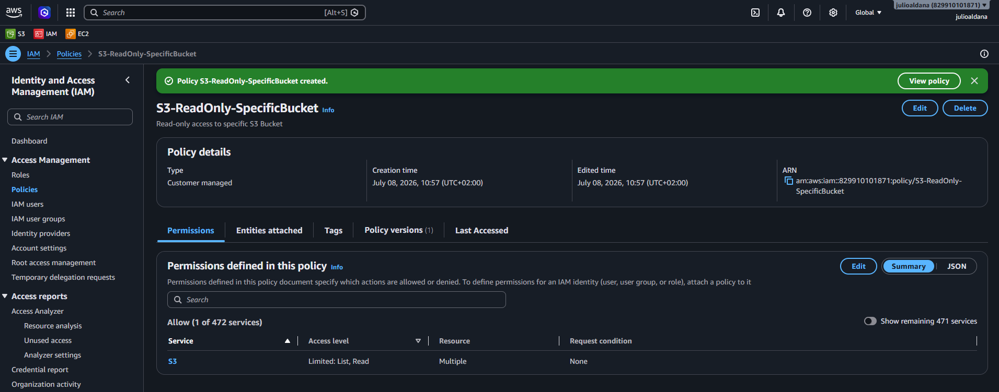
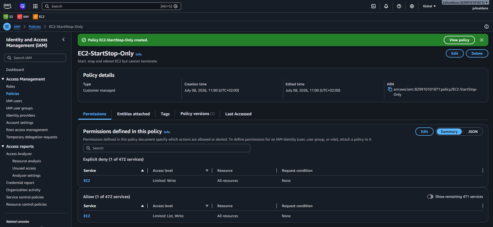
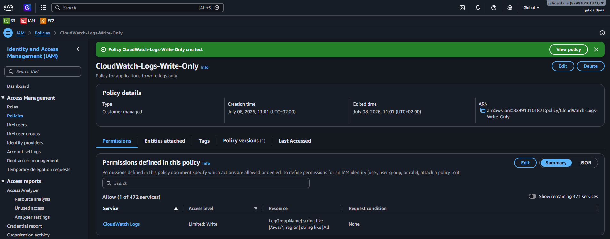
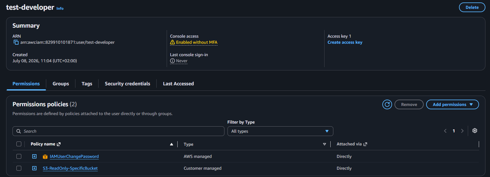
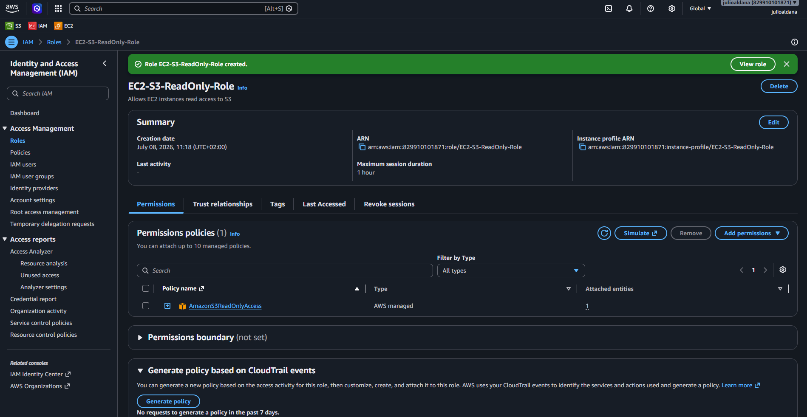
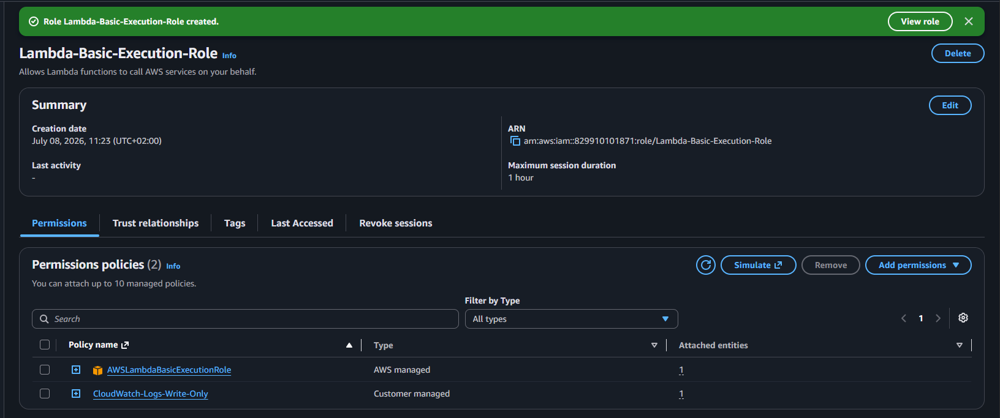
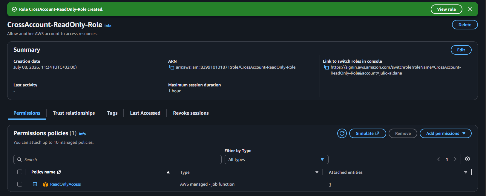
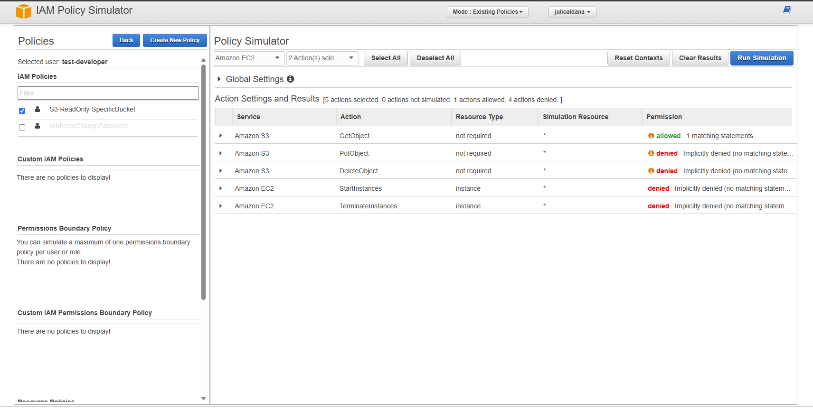
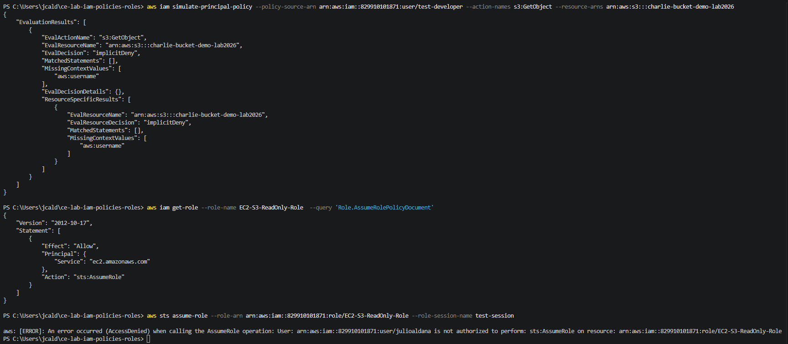

# Lab Solution: IAM Policies and Roles

**Student Name:** Julio Cesar Aldana Almanza 
**Date:** 08/07/2026  
**Lab Completion Time:** ___________ minutes

---

## Part 1: Understanding IAM Policy Structure

### Task 1: Policy Components Explanation

**Explain each component in your own words:**

**Version:**
```
It is the version of the language used to write the policy
```

**Statement:**
```
It describes what the policy does: which actions are involved and what is the effect on them.
```

**Sid:**
```
ID to identify the policy.
```

**Effect:**
```
Define whether the action is denied or allowed
```

**Action:**
```
Which commmand(s) are involved and affected in the policy.
```

**Resource:**
```
The service involved in the policy. 
```

---

## Part 2: Custom IAM Policies Created

### S3 Read-Only Policy

**Policy Name:** S3-ReadOnly-SpecificBucket

**Bucket Name Used:** dev-bucket-julio2026

**Policy JSON:**
```json
{
    "Version": "2012-10-17",
    "Statement": [
        {
            "Sid": "ListSpecificBucket",
            "Effect": "Allow",
            "Action": [
                "s3:ListBucket"
            ],
            "Resource": "arn:aws:s3:::dev-bucket-julio2026"
        },
        {
            "Sid": "ReadObjectsInBucket",
            "Effect": "Allow",
            "Action": [
                "s3:GetObject",
                "s3:GetObjectVersion"
            ],
            "Resource": "arn:aws:s3:::dev-bucket-julio2026/*"
        }
    ]
}
```

**Screenshot 1: S3 Custom Policy**


---

### EC2 Start/Stop Policy

**Policy Name:** EC2-StartStop-Only

**Policy ARN:** arn:aws:iam::829910101871:policy/EC2-StartStop-Only

**Screenshot 2: EC2 Custom Policy**


---

### CloudWatch Logs Write Policy

**Policy Name:** CloudWatch-Logs-Write-Only

**Policy ARN:** arn:aws:iam::829910101871:policy/CloudWatch-Logs-Write-Only

**Screenshot 3: CloudWatch Logs Policy**


---

## Part 3: Policy Attachments

### Policy Attached to User

**User Name:** test-developer

**Policy Attached:** S3-ReadOnly-SpecificBucket

**Attachment Method:** [X] Console ☐ CLI

**CLI Command (if used):**
```bash
_____________________________________________________________
_____________________________________________________________
```

**Screenshot 4: Policy Attached**


---

## Part 4: IAM Roles Created

### EC2 Service Role

**Role Name:** EC2-S3-ReadOnly-Role 

**Role ARN:** arn:aws:iam::829910101871:role/EC2-S3-ReadOnly-Role

**Trusted Entity:** ec2.amazonaws.com

**Attached Policies:**
1. AmazonS3ReadOnlyAccess

**Trust Relationship JSON:**
```json
{
    "Version": "2012-10-17",
    "Statement": [
        {
            "Effect": "Allow",
            "Principal": {
                "Service": "ec2.amazonaws.com"
            },
            "Action": "sts:AssumeRole"
        }
    ]
}
```

**Screenshot 5: EC2 Service Role**


---

### Lambda Execution Role

**Role Name:** Lambda-Basic-Execution-Role

**Role ARN:** arn:aws:iam::829910101871:role/Lambda-Basic-Execution-Role

**Attached Policies:**
1. AWSLambdaBasicExecutionRole
2. CloudWatch-Logs-Write-Only

**Screenshot 6: Lambda Role**


---

### Cross-Account Access Role

**Role Name:** CrossAccount-ReadOnly-Role

**Role ARN:** arn:aws:iam::829910101871:root

**External Account ID:** 829910101871

**External ID:** unique-external-id-123

**Attached Policies:**
1. ReadOnlyAccess

**Screenshot 7: Cross-Account Role**


---

## Part 5: Policy Testing

### Policy Simulator Results

**Policy Tested:** S3-ReadOnly-SpecificBucket

**Test Results:**

| Action | Expected Result | Actual Result | Pass/Fail |
|--------|----------------|---------------|-----------|
| s3:GetObject | Allowed | | [x] Pass ☐ Fail |
| s3:PutObject | Denied | | [x] Pass ☐ Fail |
| s3:DeleteObject | Denied | | [x] Pass ☐ Fail |
| ec2:StartInstances | Denied | Denied | [x] Pass ☐ Fail |
| ec2:TerminateInstances | Denied | Denied |[x] Pass ☐ Fail |

**Screenshot 8: Policy Simulator**


---

### AWS CLI Testing

**Test 1: S3 List Bucket**
```bash
# Command: aws s3 ls s3://dev-bucket-julio2026/

# Output:
(No output) - no files added yet

# Result: [x] Success ☐ Access Denied
```

**Test 2: S3 Upload File**
```bash
# Command: aws s3 cp test.txt s3://dev-bucket-julio2026/

# Output:
Unable to upload the file

# Result: ☐ Success [x] Access Denied (Expected)
```

**Test 3: S3 Download File**
```bash
# Command: aws s3 cp s3://dev-bucket-julio2026/test2.txt ./

# Output:
download: s3://dev-bucket-julio2026/test_2.txt to .\test_2.txt 

# Result: [x] Success ☐ Access Denied
```

---

## Part 6: Least Privilege Implementation

### Custom Policy with Conditions

**Policy Name:** EC2-AccessTimeFixed

**Condition Type Used:** ☐ IP Address [x] Time Window ☐ MFA ☐ Other: _______

**Policy JSON:**
```json
{
    "Version": "2012-10-17",
    "Statement": [
        {
            "Effect": "Allow",
            "Action": [
                "ec2:*"
            ],
            "Resource": "*",
            "Condition": {
                "DateGreaterThan": {
                    "aws:CurrentTime": "2026-07-08T00:00:00Z"
                },
                "DateLessThan": {
                    "aws:CurrentTime": "2026-07-09T00:00:00Z"
                }
            }
        }
    ]
}
```

**Rationale for this policy:**
```
For some projects, some resources are just needed for a specific time period. Fixing this time may reduce costs. 
```

---

## Part 7: Troubleshooting

### Issue Encountered (if any)

**Issue Description:**
```
get-user-policy command for IAM did not work 
as it is used to get policies made specific for a certain user
```

**Commands Used to Diagnose:**
```bash
aws iam simulate-principal-policy 
 \--policy-source-arn arn:aws:iam::829910101871:user/test-developer 
 \--action-names s3:GetObject 
 \--resource-arns arn:aws:s3:::charlie-bucket-demo-lab2026
 
aws iam get-role --role-name EC2-S3-ReadOnly-Role  --query 'Role.AssumeRolePolicyDocument'

aws sts assume-role \
  --role-arn arn:aws:iam::829910101871:role/EC2-S3-ReadOnly-Role \
  --role-session-name test-session
  
aws sts assume-role --role-arn arn:aws:iam::829910101871:role/EC2-S3-ReadOnly-Role --role-session-name test-session

```

**Resolution:**
```
Assign the roles to the services needed and the policies to the users needed
```

**Screenshot 9: Troubleshooting Output**


---

## Reflection Questions

### 1. Why are IAM roles preferred over access keys for EC2 instances?

**Your answer:**
```
It allows all EC2 instances to have the same permissions given on the role, instead of assigning them directly (it will take longer)
```

### 2. Explain the principle of least privilege and how you applied it in this lab.

**Your answer:**
```
It is a concept used to limit the privilege to a user or a service to work with an specific feature. 
It was applied by assigning policies to the users, roles to the services and even custom the policies to even limit more the 
privilege (reduce available time, IP Address speficic, MFA needed)
```

### 3. What is the difference between identity-based and resource-based policies?

**Your answer:**
```
Some policies are created specific for some users/groups (identity based), 
while some others are created for the resource in use. 
```

### 4. When would you use an explicit "Deny" in a policy?

**Your answer:**
```
One good example could be when you want a user to have access to the S3 resource, 
but no access to specific buckets. 
```

### 5. Describe a scenario where you'd use conditions in IAM policies.

**Your answer:**
```
In a project where I have Architects, Developers and Testers. 
Architects would have full access to the OS and Design files of the projects
Developers may require specific access to the OS, but Design files can be read-only
Testers may require read-only access to desing and application files, but full access to testing code.

```

---

## Summary of Resources Created

**IAM Policies:**
1. S3-ReadOnly-SpecificBucket  (ARN: arn:aws:iam::829910101871:policy/S3-ReadOnly-SpecificBucket)
2. EC2-StartStop-Only  (ARN: arn:aws:iam::829910101871:policy/EC2-StartStop-Only)
3. EC2-AccessTimeFixed  (ARN: arn:aws:iam::829910101871:policy/EC2-AccessTimeFixed)

**IAM Roles:**
1. EC2-S3-ReadOnly-Role  (ARN: arn:aws:iam::829910101871:role/EC2-S3-ReadOnly-Role)
2. Lambda-Basic-Execution-Role  (ARN: arn:aws:iam::829910101871:role/Lambda-Basic-Execution-Role)
3. CrossAccount-ReadOnly-Role   (ARN: arn:aws:iam::829910101871:role/CrossAccount-ReadOnly-Role)

**Users Modified:**
1. test-developer

---

## Cleanup Confirmation

- [x] Detached all custom policies from users
- [x] Deleted custom IAM policies
- [x] Detached policies from roles
- [x] Deleted test IAM roles
- [x] Verified no resources remain

**Cleanup Commands:**
```bash
aws iam detach-user-policy --user-name test-developer --policy-arn arn:aws:iam::829910101871:policy/S3-ReadOnly-SpecificBucket
aws iam delete-policy --policy-arn arn:aws:iam::829910101871:policy/S3-ReadOnly-SpecificBucket
aws iam detach-role-policy --role-name EC2-S3-ReadOnly-Role --policy-arn arn:aws:iam::aws:policy/AmazonS3ReadOnlyAccess
aws iam delete-role --role-name EC2-S3-ReadOnly-Role
```

---

## Self-Assessment

**Rate your understanding (1-5):**

| Concept | Before Lab | After Lab | Improvement |
|---------|-----------|-----------|-------------|
| IAM Policy Structure | 2/5 | 5/5 | +3 |
| Custom Policy Creation | 2/5 | 5/5 | +3 |
| IAM Roles | 1/5 | 3/5 | +2 |
| Service Roles | 1/5 | 2/5 | +1 |
| Trust Relationships | 0/5 | 3/5 | +3 |
| Policy Testing | 0/5 | 5/5 | +5 |
| Least Privilege | 3/5 | 5/5 | +2 |
| Troubleshooting IAM | 0/5 | 2/5 | +2 |

---

## Instructor Verification

**Instructor Name:** ___________________________

**Date Reviewed:** ___________________________

**All policies validated:** ☐ Yes ☐ No

**Roles properly configured:** ☐ Yes ☐ No

**Comments:**
```
_____________________________________________________________
_____________________________________________________________
_____________________________________________________________
```

**Grade/Status:** ___________________________

---

**Lab Status:** ☐ Complete ☐ Needs Revision

**Submission Date:** 08/07/2026
